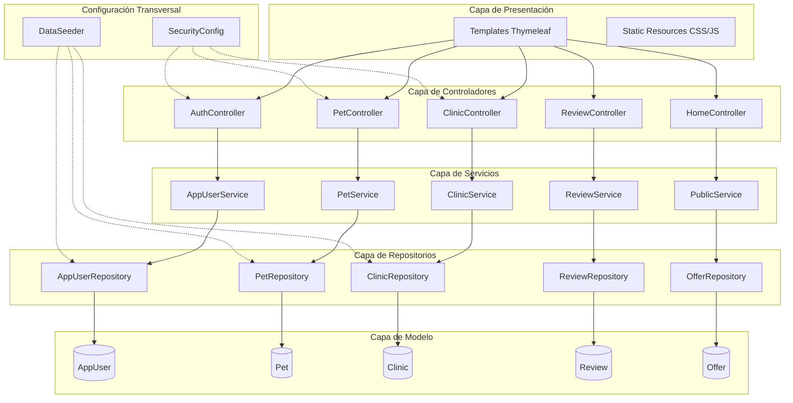
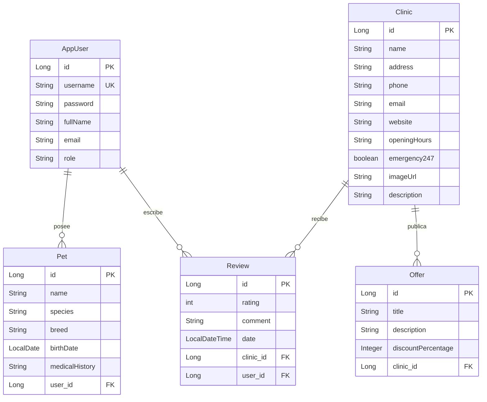
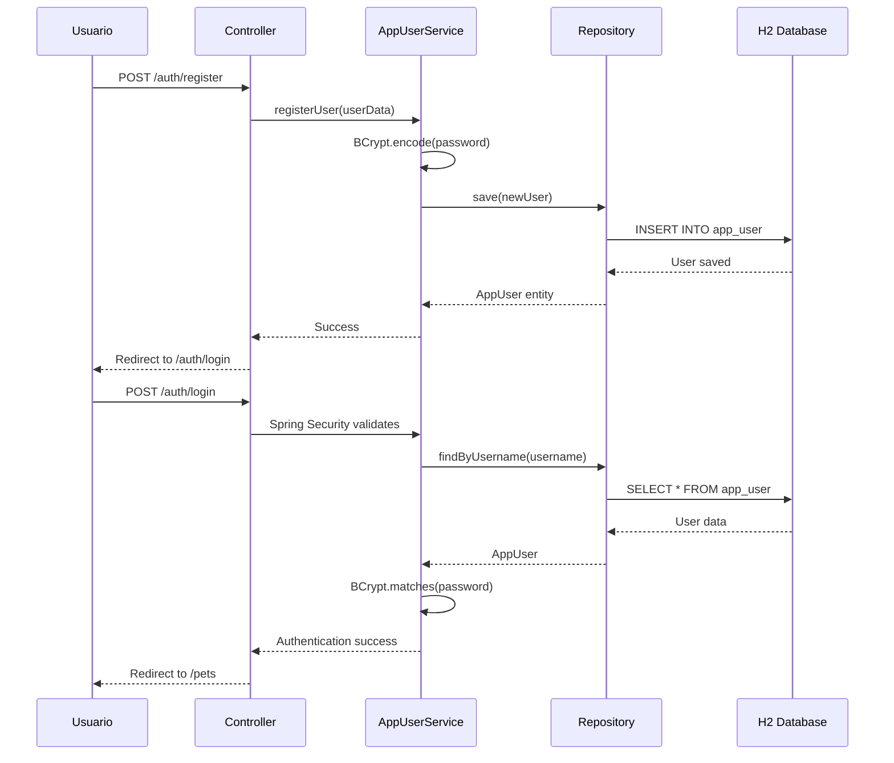
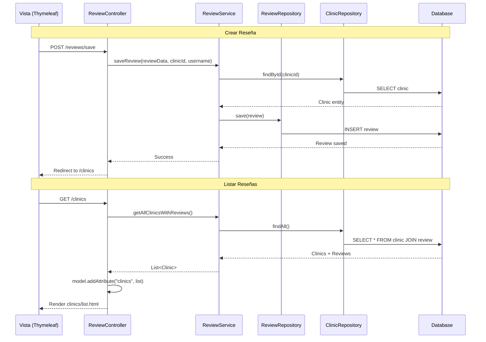

# Arquitectura del Proyecto KuichiWeb

## 📋 Descripción General

**KuichiWeb** es una plataforma web veterinaria desarrollada con Spring Boot que permite a los usuarios gestionar sus mascotas, explorar clínicas veterinarias, ver ofertas y dejar reseñas. El proyecto implementa una arquitectura en capas siguiendo las mejores prácticas de Spring Framework.

---

## 🏗️ Stack Tecnológico

### Framework y Versiones
- **Spring Boot**: 3.2.5
- **Java**: 21
- **Maven**: Gestión de dependencias

### Dependencias Principales

| Dependencia | Propósito |
|------------|-----------|
| `spring-boot-starter-web` | Desarrollo de aplicaciones web con Spring MVC |
| `spring-boot-starter-thymeleaf` | Motor de plantillas para vistas HTML |
| `spring-boot-starter-data-jpa` | Persistencia de datos con JPA/Hibernate |
| `spring-boot-starter-security` | Autenticación y autorización |
| `thymeleaf-extras-springsecurity6` | Integración de Thymeleaf con Spring Security |
| `h2` | Base de datos en memoria (desarrollo) |
| `spring-boot-devtools` | Herramientas de desarrollo (hot reload) |

### Configuración de Base de Datos

```properties
# H2 Database (En memoria)
spring.datasource.url=jdbc:h2:mem:kuichidb
spring.datasource.username=sa
spring.jpa.hibernate.ddl-auto=update
spring.h2.console.enabled=true  # Acceso: http://localhost:8080/h2-console
```

---

## 🎯 Arquitectura en Capas

El proyecto sigue el patrón de **arquitectura en capas** (Layered Architecture) típico de Spring Boot:



### 1. **Capa de Presentación** (`templates/` y `static/`)

Contiene las vistas Thymeleaf y recursos estáticos:

- **Templates**:
  - `auth/` - Login y registro
  - `pets/` - Gestión de mascotas
  - `clinics/` - Listado y formularios de clínicas
  - `home.html` - Landing page
  - `offers.html` - Ofertas públicas
  - `layout/` - Plantillas base

### 2. **Capa de Controladores** (`controller/`)

Maneja las peticiones HTTP y coordina la lógica de presentación:

| Controlador | Responsabilidad |
|------------|-----------------|
| `AuthController` | Autenticación (login, registro) |
| `PetController` | CRUD de mascotas del usuario |
| `ClinicController` | CRUD de clínicas veterinarias |
| `ReviewController` | CRUD de reseñas de clínicas |
| `HomeController` | Páginas públicas (home, ofertas) |

### 3. **Capa de Servicios** (`service/`)

Contiene la lógica de negocio:

| Servicio | Función |
|----------|---------|
| `AppUserService` | Gestión de usuarios y autenticación |
| `PetService` | Lógica de negocio de mascotas |
| `ClinicService` | Lógica de negocio de clínicas |
| `ReviewService` | Gestión de reseñas y cálculo de ratings |
| `PublicService` | Servicios públicos (ofertas, búsquedas) |

### 4. **Capa de Repositorios** (`repository/`)

Interfaces JPA para acceso a datos (extienden `JpaRepository`):

```java
// Ejemplo de repositorio
public interface AppUserRepository extends JpaRepository<AppUser, Long> {
    Optional<AppUser> findByUsername(String username);
}
```

### 5. **Capa de Modelo** (`model/`)

Entidades JPA que representan el dominio:

---

## 📊 Modelo de Dominio



### Relaciones del Modelo

1. **AppUser ↔ Pet** (One-to-Many)
   - Un usuario puede tener múltiples mascotas
   - Relación bidireccional con `@OneToMany` y `@ManyToOne`

2. **AppUser ↔ Review** (One-to-Many)
   - Un usuario puede escribir múltiples reseñas
   - Cada reseña tiene un autor

3. **Clinic ↔ Offer** (One-to-Many)
   - Una clínica puede publicar múltiples ofertas
   - Cascade: eliminar clínica elimina sus ofertas

4. **Clinic ↔ Review** (One-to-Many)
   - Una clínica puede recibir múltiples reseñas
   - Método auxiliar `getAverageRating()` calcula el promedio

---

## 🔒 Seguridad (Spring Security)

### Configuración de Autenticación

```java
@Configuration
@EnableWebSecurity
public class SecurityConfig {
    
    @Bean
    public PasswordEncoder passwordEncoder() {
        return new BCryptPasswordEncoder();
    }
    
    @Bean
    public SecurityFilterChain securityFilterChain(HttpSecurity http) {
        // Configuración de autorización
    }
}
```

### Reglas de Autorización

| Ruta | Acceso | Descripción |
|------|--------|-------------|
| `/`, `/home` | Público | Landing page |
| `/auth/**` | Público | Login y registro |
| `/offers/**` | Público | Ver ofertas |
| `/clinics` (GET) | Público | Listar clínicas |
| `/clinics/**` (POST/PUT/DELETE) | Autenticado | CRUD de clínicas |
| `/pets/**` | Autenticado | Gestión de mascotas |
| `/reviews/**` | Autenticado | CRUD de reseñas |
| `/h2-console/**` | Público (dev) | Consola H2 |

### Flujo de Autenticación



---

## 🔄 Flujo de Datos (Ejemplo: CRUD de Reseñas)



---

## 🌱 Inicialización de Datos (DataSeeder)

El proyecto incluye un componente `DataSeeder` que se ejecuta al iniciar la aplicación:

```java
@Component
public class DataSeeder implements CommandLineRunner {
    
    @Override
    public void run(String... args) {
        // Crear usuario admin
        // Crear clínicas de ejemplo
        // Crear ofertas de ejemplo
        // Crear mascotas de ejemplo
    }
}
```

**Datos precargados**:
- Usuario administrador (username: `admin`)
- Clínicas veterinarias de ejemplo
- Ofertas promocionales
- Mascotas de prueba

---

## 📁 Estructura de Directorios

```
KuichiWeb/
├── src/
│   ├── main/
│   │   ├── java/cl/kuichi/kuichiweb/
│   │   │   ├── KuichiWebApplication.java    # Clase principal
│   │   │   ├── config/
│   │   │   │   ├── SecurityConfig.java      # Configuración de seguridad
│   │   │   │   └── DataSeeder.java          # Datos iniciales
│   │   │   ├── controller/
│   │   │   │   ├── AuthController.java
│   │   │   │   ├── PetController.java
│   │   │   │   ├── ClinicController.java
│   │   │   │   ├── ReviewController.java
│   │   │   │   └── HomeController.java
│   │   │   ├── model/
│   │   │   │   ├── AppUser.java
│   │   │   │   ├── Pet.java
│   │   │   │   ├── Clinic.java
│   │   │   │   ├── Review.java
│   │   │   │   └── Offer.java
│   │   │   ├── repository/
│   │   │   │   ├── AppUserRepository.java
│   │   │   │   ├── PetRepository.java
│   │   │   │   ├── ClinicRepository.java
│   │   │   │   ├── ReviewRepository.java
│   │   │   │   └── OfferRepository.java
│   │   │   └── service/
│   │   │       ├── AppUserService.java
│   │   │       ├── PetService.java
│   │   │       ├── ClinicService.java
│   │   │       ├── ReviewService.java
│   │   │       └── PublicService.java
│   │   └── resources/
│   │       ├── application.properties       # Configuración de la app
│   │       ├── static/                      # CSS, JS, imágenes
│   │       └── templates/                   # Vistas Thymeleaf
│   │           ├── auth/
│   │           ├── pets/
│   │           ├── clinics/
│   │           ├── layout/
│   │           ├── home.html
│   │           └── offers.html
│   └── test/                                # Tests unitarios
├── pom.xml                                  # Dependencias Maven
└── ARQUITECTURA.md                          # Este documento
```

---

## 🎨 Patrones de Diseño Utilizados

### 1. **MVC (Model-View-Controller)**
- **Model**: Entidades JPA (`model/`)
- **View**: Templates Thymeleaf (`templates/`)
- **Controller**: Controladores Spring (`controller/`)

### 2. **Repository Pattern**
- Abstracción del acceso a datos mediante interfaces JPA
- Separa la lógica de persistencia de la lógica de negocio

### 3. **Service Layer Pattern**
- Capa de servicios que encapsula la lógica de negocio
- Los controladores delegan operaciones complejas a los servicios

### 4. **Dependency Injection**
- Spring gestiona todas las dependencias mediante `@Autowired`
- Facilita testing y desacoplamiento

### 5. **DTO (Data Transfer Object)** - Implícito
- Las entidades JPA actúan como DTOs entre capas
- Thymeleaf recibe objetos del modelo directamente

---

## 🚀 Flujo de Ejecución de la Aplicación

1. **Inicio de la aplicación**:
   ```
   KuichiWebApplication.main() 
   → Spring Boot inicializa contexto
   → DataSeeder carga datos iniciales
   → Servidor Tomcat embebido en puerto 8080
   ```

2. **Petición HTTP**:
   ```
   Cliente HTTP Request
   → Spring Security (autenticación/autorización)
   → DispatcherServlet
   → Controller (@GetMapping/@PostMapping)
   → Service (lógica de negocio)
   → Repository (acceso a datos)
   → JPA/Hibernate (SQL)
   → H2 Database
   → Respuesta inversa hasta Thymeleaf
   → HTML renderizado al cliente
   ```

3. **Renderizado de vistas**:
   ```
   Controller retorna String "viewName"
   → Thymeleaf Template Engine
   → Procesa th:* attributes
   → Inyecta datos del modelo
   → Genera HTML final
   → Envía al navegador
   ```

---

## 🔧 Configuración y Despliegue

### Requisitos
- Java 21 o superior
- Maven 3.6+
- Puerto 8080 disponible

### Comandos de Ejecución

```bash
# Compilar el proyecto
mvn clean install

# Ejecutar la aplicación
mvn spring-boot:run

# Acceder a la aplicación
# http://localhost:8080

# Acceder a la consola H2
# http://localhost:8080/h2-console
# JDBC URL: jdbc:h2:mem:kuichidb
# Username: sa
# Password: (vacío)
```

### Variables de Entorno (Producción)

Para producción, se recomienda externalizar la configuración:

```properties
# Cambiar a base de datos persistente
spring.datasource.url=${DATABASE_URL}
spring.datasource.username=${DB_USERNAME}
spring.datasource.password=${DB_PASSWORD}

# Deshabilitar H2 console
spring.h2.console.enabled=false

# Habilitar caché de Thymeleaf
spring.thymeleaf.cache=true
```

---

## 📈 Mejoras Futuras Sugeridas

1. **Seguridad**:
   - Implementar roles más granulares (USER, ADMIN, CLINIC_OWNER)
   - Añadir CSRF protection en formularios
   - Implementar OAuth2 para login social

2. **Persistencia**:
   - Migrar de H2 a PostgreSQL/MySQL para producción
   - Implementar Flyway/Liquibase para migraciones

3. **API REST**:
   - Crear endpoints REST para consumo móvil
   - Implementar versionado de API

4. **Testing**:
   - Añadir tests unitarios con JUnit 5
   - Tests de integración con @SpringBootTest
   - Tests de seguridad

5. **Frontend**:
   - Mejorar UX con JavaScript/AJAX
   - Implementar validaciones del lado del cliente
   - Añadir sistema de notificaciones

6. **Funcionalidades**:
   - Sistema de citas veterinarias
   - Chat en tiempo real
   - Notificaciones por email
   - Sistema de pagos para ofertas premium

---

## 📝 Conclusión

KuichiWeb es una aplicación web bien estructurada que sigue las mejores prácticas de Spring Boot. Su arquitectura en capas facilita el mantenimiento, testing y escalabilidad. El uso de Spring Security garantiza la protección de recursos, mientras que JPA/Hibernate simplifica la persistencia de datos.

La separación clara de responsabilidades entre controladores, servicios y repositorios permite que el código sea modular y fácil de extender con nuevas funcionalidades.
